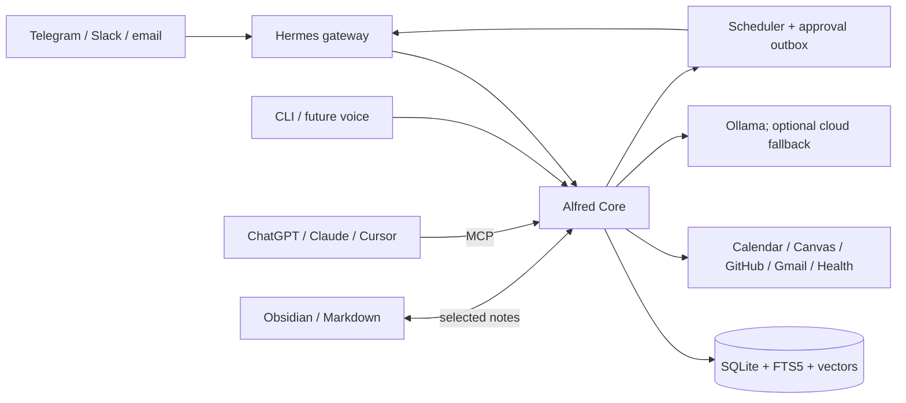

# Alfred architecture

Status: proposed MVP architecture<br>
Last verified: 2026-08-11<br>
Goal: a cheap, local-first, open-source personal secretary that remembers, briefs, and acts across many clients and services.

> Canonical rule: store broadly, retrieve narrowly, act cautiously. Never put the full archive in an LLM prompt.

**Plain English:** SQLite is Alfred's private filing cabinet. A small knowledge graph is the map showing how the important things in that cabinet relate. Obsidian is an optional notebook where the owner can inspect and edit selected memories. Telegram is the free phone remote. The filing cabinet remains authoritative, so no model, chat app, or note-taking app can lock Alfred's memory away.

## 1. Decisions

1. **Do not fork Hermes yet.** Use upstream Hermes as the agent runtime and messaging gateway. Publish Alfred as a Hermes profile distribution plus a standalone `alfred-core` package. Fork only if a required core change cannot be implemented through a profile, skill, plugin, memory provider, or MCP boundary.
2. **Alfred Core owns the data.** Hermes, ChatGPT, Claude, Cursor, Telegram, and future voice clients are replaceable interfaces. None is the source of truth.
3. **Run a modular monolith on the always-on PC.** One Python service and one SQLite database are cheaper and easier to back up than microservices. Split services only after measured need.
4. **Use MCP in both directions.** Alfred serves stable personal-assistant tools to AI clients and consumes MCP tools where useful. Durable background sync should use official provider APIs, not depend on an interactive MCP client.
5. **Use Telegram first.** Its bot platform is free and supports long polling, so the PC needs no inbound public port. Add Slack and email later. iMessage is last because Apple has no comparable general-purpose bot API; practical bridges require an always-on Mac and add fragility.
6. **Use local inference by default.** Ollama handles embeddings, extraction, classification, summaries, and routine tool selection when hardware permits. Cloud models are optional fallbacks behind a monthly hard cap and a sensitive-data egress policy.
7. **Target Google Health API, not legacy Fitbit Web API.** The legacy Fitbit API is scheduled to stop syncing in September 2026.
8. **Start read-only.** Calendar, Canvas, GitHub, mail, and health begin as readers. Enable narrowly scoped writes only after audit logs, idempotency, and approvals work.
9. **License new Alfred code Apache-2.0.** Keep Hermes as an upstream MIT dependency and retain third-party notices. User data, tokens, memories, and logs never ship in the distribution.
10. **Build a lightweight knowledge graph inside SQLite.** Use Northwind-style typed, temporal entities and relationships with confidence and provenance. Do not add Neo4j or another graph database until measurements prove SQLite inadequate.
11. **Make Obsidian an optional, free projection.** Alfred never requires paid Obsidian Sync. Selected memories are ordinary Markdown, and Alfred continues to work with no Obsidian installation or with any Markdown editor.

## 2. System shape



There are two independent planes:

- **Data plane — `alfred-core`:** memory, tasks, reminders, connectors, briefing, policy, audit, and MCP.
- **Agent plane — Hermes:** conversation loop, model/provider selection, skills, sandboxed task execution, gateway UX, and channel delivery.

Alfred Core is the sole owner of user schedules, reminders, retries, and the delivery outbox. It hands due output to a narrow Hermes delivery adapter. Hermes's native cron is disabled for user work (or limited to runtime health checks), preventing two job stores from drifting.

Hermes connects to Alfred Core over local stdio MCP. Claude Desktop/Code and Cursor can use the same stdio entry point. Remote clients use Streamable HTTP. ChatGPT cannot connect directly to a local MCP server; use OpenAI's outbound-only Secure MCP Tunnel for a private installation. A public Alfred service would instead require stable HTTPS and OAuth.

ChatGPT and Claude subscriptions are not API credits. When they are MCP clients, their UI supplies the model. When Alfred runs unattended, it needs Ollama or separately billed API access.

The phone does not connect to SQLite or require Obsidian. It messages the Telegram bot, Hermes passes the request to Alfred Core on the PC, and Alfred replies with current memory and tasks. This works while the PC is awake. Optional Markdown sync can make selected Obsidian notes available offline on the phone, but it is not part of Alfred's control path.

## 3. Components

### Hermes distribution

The Alfred distribution contains only shareable behavior:

```text
distribution.yaml
SOUL.md                  # voice, boundaries, compact operating rules
config.yaml              # safe defaults; user overrides survive updates
mcp.json                 # starts/connects to alfred-core
skills/                  # morning brief, inbox triage, weekly review
cron/                    # optional runtime health checks only
README.md
```

Hermes's built-in memory remains a tiny bootstrap/persona cache. Alfred Core is canonical to avoid split-brain memory. Hermes session history may be imported into Alfred's event log, but Alfred never writes directly to Hermes internals.

### Alfred Core modules

| Module | Responsibility |
|---|---|
| `ingest` | Accept messages/webhooks/polls; deduplicate; append source events. |
| `memory` | Extract, validate, graph, version, retrieve, correct, export, and forget memories. |
| `vault` | Optionally import and project selected memories as portable Markdown. |
| `tasks` | Canonical tasks, commitments, reminders, and status transitions. |
| `connectors` | OAuth, sync cursors, normalized reads, and scoped actions. |
| `briefing` | Deterministic gather/rank, then one optional LLM writing pass. |
| `policy` | Identity, sensitivity, client scopes, approvals, and cloud egress. |
| `jobs` | Persistent schedules, retries, misfires, and delivery outbox. |
| `mcp` | One semantic tool surface over stdio and Streamable HTTP. |
| `models` | Ollama first; optional OpenAI/Anthropic-compatible adapters and budgets. |
| `audit` | Append-only tool/action records with redacted arguments and outcomes. |

Implementation baseline: Python, `uv`, Pydantic, official MCP Python SDK, SQLite in WAL mode, FTS5, and `sqlite-vec`. Use the same core functions from CLI, jobs, HTTP, and MCP; transports contain no business logic.

### Connector contract

Every connector implements the same narrow interface:

```text
authorize() -> account
sync(cursor) -> events + next_cursor
query(request) -> normalized records
propose(action) -> preview
execute(approved_action, idempotency_key) -> receipt
health() -> status
```

Each connector declares read/write capabilities, OAuth scopes, sensitivity, polling/webhook support, and rate limits. A normalized event always retains `source`, `account`, `external_id`, timestamps, and a deep link to the original.

Prefer official APIs for reliable sync. Third-party MCP servers are acceptable for optional/ad-hoc tools, but must be allowlisted and cannot receive Alfred secrets other than their own scoped credential.

## 4. Memory: what “remember everything” means

Alfred keeps an inspectable archive of consented inputs, not an impossible infinite prompt.

### Layers

1. **Raw event log:** immutable user messages and normalized source events. This is the recoverable truth.
2. **Documents/chunks:** searchable text or attachment metadata linked to raw events.
3. **Derived memory and graph:** facts, preferences, people, projects, decisions, habits, commitments, and their relationships. Each claim has provenance, confidence, validity dates, sensitivity, and version history.
4. **Working context:** a small request-specific pack assembled at runtime.

Corrections supersede old derived memories; they do not rewrite history. Conflicting facts remain visible until resolved. External mail/files are indexed by ID, metadata, and minimal excerpts by default rather than copied wholesale. Users can export or delete by source, time range, person, topic, or individual item.

### Core records

| Record | Essential fields |
|---|---|
| `events` | source, external ID, occurred/ingested time, content, metadata, sensitivity, hash |
| `documents` | event ID, URI/path, MIME type, checksum, retention policy |
| `memories` | kind, statement, confidence, valid range, source refs, supersedes, status |
| `entities` / `edges` | people/projects/courses and typed relationships |
| `tasks` | title, state, priority, due time, source, recurrence, owner |
| `jobs` / `outbox` | schedule, next run, payload, attempts, idempotency key, delivery state |
| `tool_runs` / `approvals` | actor, client, tool, redacted input, decision, result, timestamp |
| `sync_state` | connector account, cursor, last success/error, backoff |

Retrieval is hybrid: FTS5 keyword match + vector similarity + time/importance/entity filters, followed by lightweight reranking. Embeddings are generated locally and versioned by model so they can be rebuilt. Promote to Postgres/pgvector only if multi-user operation or measured SQLite limits require it.

### Learning loop

- Save explicit statements and corrections immediately with provenance.
- Extract implicit preferences as low-confidence candidates; promote only after repetition or confirmation.
- Turn repeated workflows into versioned skills only after showing a diff for approval.
- Record accepted/rejected suggestions and retrieval misses as evaluation data.
- Do not fine-tune in the MVP. Better memory, retrieval, policies, and evals produce safer learning at far lower cost.

## 5. Knowledge graph and Obsidian

### One memory, four views

| Layer | Job | Authoritative? |
|---|---|---|
| SQLite events/documents | Receipts: what was actually said or synced | Yes; historical evidence |
| SQLite knowledge graph | Current structured understanding of people, projects, courses, goals, and preferences | Yes; versioned derived state |
| Obsidian/Markdown vault | Human-readable notes and selected graph projections | Only for notes the user authors or explicitly edits |
| Runtime retrieval | The tiny evidence pack relevant to the current question | No; temporary |

The graph is a **layer over evidence**, not a replacement for messages and documents. If extraction improves, Alfred can rebuild derived graph records from retained evidence. Obsidian is not the database, job queue, audit log, or secret store.

### Minimal graph model

Keep the graph in the same SQLite database as the rest of Alfred:

| Table | Minimum contents |
|---|---|
| `entities` | stable ID, type, label, properties, domain tags, sensitivity, confidence, confirmed flag, created/updated times |
| `aliases` | entity ID, alternate label, source, confidence |
| `relationships` | source entity, predicate, target entity, state/event kind, single/multi cardinality, valid-from/to, domain, sensitivity, confidence, confirmed flag |
| `evidence` | memory/entity/relationship ID, event/document/chunk reference, source account, extraction version, excerpt hash |
| `type_registry` / `relation_registry` | allowed types, predicates, constraints, and plain-language descriptions |
| `memory_history` | proposed, accepted, superseded, rejected, or deleted versions and actor |

Graph rules:

- Create one permanent `self` entity representing the owner.
- Make durable named things nodes: people, organizations, courses, projects, goals, documents, tasks, and meaningful preferences. Keep simple values such as an email address, due date, or status as properties instead of turning everything into a node.
- Every relationship is typed and temporal. An **event** records something that happened; a **state** describes what is currently true. A single-cardinality state, such as `self studies_at school`, automatically closes the previous active edge when corrected.
- Never silently overwrite history. Corrections supersede memories or close old state edges while evidence remains inspectable.
- Attach provenance, domain, confidence, confirmation, and sensitivity to every inferred claim. Explicit user statements and designated user-authored notes are high-trust evidence. Model inferences begin as candidates and remain softly quarantined until confirmed or supported repeatedly.
- Let an LLM propose strict structured objects; deterministic validation and registry rules decide what enters the graph. New entity or relation types remain unconfirmed until approved.
- Use conservative entity resolution. It is safer to temporarily keep two possible "Alex" entities than to merge two people incorrectly.

Do not graph every message or add a graph server in v1. Also defer the in-memory Graphology mirror, PageRank, community detection, complex weighting, a giant ontology, and graph visualization. Add them only for a measured retrieval or product need.

### Retrieval

For each request Alfred applies client/sensitivity permissions, finds anchor records with FTS5 and local embeddings, expands only one or two graph hops, reranks by relevance/recency/confidence, and returns a token-budgeted pack with evidence links. This gets the benefit of a graph without sending the entire graph—or life history—to a model.

### Obsidian vault

The optional vault is plain Markdown and stays useful without Alfred:

```text
alfred-vault/
  Inbox/
  People/
  Projects/
  Courses/
  Decisions/
  Daily/
  Generated/
```

Every managed or linked note gets a stable ID in YAML frontmatter; normal `[[wiki links]]` can express relationships:

```yaml
---
alfred_id: project_01J...
type: project
sensitivity: personal
managed: false
updated: 2026-08-11T09:00:00-04:00
---
```

Synchronization rules:

- A file watcher hashes changed notes, parses frontmatter and links, appends a file event, then proposes validated memory/graph updates. User-authored designated notes count as confirmed evidence, but do not bypass action permissions.
- Alfred writes whole generated notes only under `Generated/`, or writes within clearly marked managed blocks elsewhere. It never blindly overwrites user prose.
- Stable IDs plus content hashes prevent duplicates. A stale or concurrent edit creates a conflict copy for review. A future open-source Obsidian plugin should use the Vault API's conflict-safe processing methods.
- Deleting a projected note does not secretly erase raw history. The explicit `forget` command handles scoped deletion and records an audit tombstone.
- Never place credentials, connector cursors, audit logs, the SQLite database, raw message archives, or detailed raw health data in the vault. Project only selected summaries and notes.

### Phone access without paying for Obsidian

The default phone experience is Telegram, which exposes the full assistant while the PC is online. Obsidian mobile access is optional and only needed to browse or edit the Markdown notebook offline.

Alfred does **not** use the paid Obsidian Sync service. If mobile Markdown sync is later wanted:

1. Sync only `alfred-vault/`, never `alfred.db`, secrets, or logs.
2. Select one maintained free method for the actual phone OS; do not mix sync systems on one vault.
3. For a Windows PC plus iPhone/iPad, do not make iCloud Drive the default because Obsidian documents duplication/corruption risks on Windows. Prefer a vetted, mobile-compatible open-source community adapter backed by a self-hosted WebDAV/CouchDB service over a private encrypted network.
4. For Android, use the same self-hosted route or a maintained folder-sync tool. Treat the sync adapter as replaceable.

That optional route has no required software subscription, although the PC/storage and network still have real operating costs. The phone retains its last synchronized Markdown copy offline; live Alfred queries still require Alfred Core to be running.

### Open-source boundary

Obsidian itself is a separate, optional proprietary application; this does not prevent Alfred from being open-source. Alfred Core, its Markdown adapter, and any Alfred Obsidian plugin use Apache-2.0, call only documented interfaces, and do not redistribute Obsidian. Plain Markdown plus JSON exports avoid lock-in, and a fully open-source editor can replace Obsidian. Northwind is design inspiration: borrow the data invariants and retrieval pattern described by the owner, but copy no Northwind code or assets unless their license is independently verified as compatible. Personal vaults, databases, tokens, and generated backups are gitignored and never included in releases.

## 6. Token and cost controls

Default extra context budget, excluding the current message and selected tool schemas: **3,000 tokens**.

| Context slice | Max tokens |
|---|---:|
| Persona + hard rules | 250 |
| Stable user profile | 350 |
| Active goals/tasks | 400 |
| Retrieved memories | 900 |
| Conversation summary | 700 |
| Reserve | 400 |

Rules:

- Retrieve summaries first; fetch raw excerpts only when evidence is needed.
- Expose only the tool group relevant to the turn, ideally no more than 8 tools.
- Cache embeddings, connector results, daily aggregates, and conversation summaries.
- Use deterministic code for sync, sorting, due-date logic, and threshold alerts.
- Use one small/local model pass for extraction and at most one for a routine brief.
- Escalate to a cloud model only for explicitly classified hard tasks; redact secrets and sensitive health/message content first.
- Track input/output tokens and estimated cost per run. Default monthly cloud budget is `$0`; fail closed when the configured cap is reached.

Local software can cost `$0/month`; electricity, existing subscriptions, a domain, or optional cloud inference are not free. The PC must be awake for live replies and scheduled work. Persistent jobs run missed executions once after restart and label the result late.

## 7. MCP surface

Expose semantic Alfred operations rather than every provider endpoint:

```text
memory_search        profile_get          remember
forget               agenda_get          task_upsert
task_complete        reminder_set         brief_get
message_draft        action_commit        connector_status
```

`message_draft` and other consequential operations return a preview. `action_commit` requires the preview ID plus a fresh approval token. MCP annotations mark tools read-only/destructive where supported. Per-client scopes prevent a coding client from receiving health data or sending personal messages unless explicitly granted.

Transport policy:

- Local Hermes, Claude, Cursor: stdio.
- Deployed/private clients: Streamable HTTP on `/mcp`; never build new work on legacy SSE.
- Local server binds `127.0.0.1` only. Validate `Origin`, authenticate every remote request, and use OAuth 2.1/RFC 9728 metadata for public remote access.
- ChatGPT private access: Secure MCP Tunnel. Public distribution: HTTPS + OAuth and a separate security review.

## 8. Permissions and safety

| Action class | Default |
|---|---|
| Read/sync approved sources | Automatic |
| Store user message; derive low-risk memory | Automatic, visible in audit |
| Create/edit local task or reminder | Automatic and reversible |
| Calendar write, GitHub write, file mutation | Preview + confirm initially |
| Send email/message, submit school work, publish/push | Always preview + confirm |
| Delete data, spend money, merge, security/credential change | Strong confirm; never unattended |
| Health writes | Disabled in v1 |

Additional invariants:

- Secrets live in the OS credential store, never SQLite, logs, prompts, Markdown, or git.
- Require full-disk encryption and encrypted, versioned backups. Test restore monthly.
- Tag data `public`, `personal`, `sensitive`, or `secret`; model and client policies filter before retrieval.
- Treat email, web pages, issues, and documents as untrusted content. They cannot override Alfred rules or authorize tools.
- All mutations use idempotency keys and a transactional outbox; retry only safe/retriable failures.
- Default-deny channel identity. Pair Telegram/Slack user IDs locally.
- Every answer based on synced data includes source links and freshness; stale sync is explicit.

## 9. Connector order

| Phase | Connectors and behavior |
|---|---|
| MVP | Telegram long polling; local tasks/reminders; Ollama; manual memory import |
| Assistant | Google Calendar read; Canvas upcoming/missing assignments; morning brief |
| Developer | GitHub notifications/issues/PRs; repo-scoped fine-grained PAT, then GitHub App for distribution |
| Communications | Gmail read/draft, then send approval; Slack Socket Mode; inbound Alfred email |
| Wearable | Google Health API read-only: sleep/activity/heart metrics with strict sensitive-data policy |
| Clients | Claude/Cursor stdio MCP; ChatGPT via Secure MCP Tunnel or hosted OAuth endpoint |
| Later | Voice input/output; iMessage only through a separately isolated Mac bridge |

Canvas starts with an institution-issued personal token only for the owner's private installation if school policy permits it. A distributed app must use institution-approved OAuth; [Canvas explicitly disallows](https://developerdocs.instructure.com/services/canvas/oauth2/file.oauth) asking other users to paste manually generated tokens. Store assignments and missing-submission state, not grades or course files unless requested.

The morning brief gathers data without an LLM, ranks due/overdue items using rules, adds calendar conflicts and optionally sleep context, then asks the local model to write a short brief. The message always shows data freshness and links back to Calendar, Canvas, or GitHub.

## 10. Build slices

1. **Walking skeleton:** Alfred Core, SQLite migrations, stdio MCP, CLI, audit log, and tests.
2. **First useful loop:** Telegram message → event log → task/reminder → Telegram receipt.
3. **Daily secretary:** Google Calendar + Canvas read sync → persistent morning brief → late/missed-run recovery.
4. **Memory:** typed temporal graph, provenance/confidence, hybrid retrieval, corrections, export/forget, local embeddings, and evaluation fixtures.
5. **Safe action:** drafts, approvals, idempotent outbox, then Gmail/GitHub/Calendar writes.
6. **More surfaces:** Claude/Cursor; private ChatGPT tunnel; Slack/email; Google Health.
7. **Notebook and polish:** Obsidian/Markdown projection, optional free mobile sync adapter, admin UI, encrypted backup/restore, installer, public documentation, and release signing.

The first acceptance test is end-to-end: tell Alfred on Telegram “my paper is due Friday; remind me Thursday,” see the sourced memory and task, receive the reminder, and see it ranked correctly in the next morning brief after a restart.

## 11. Fork rule and escape hatch

Stay on a pinned upstream Hermes release and upgrade deliberately. Build Alfred-specific behavior outside Hermes. Fork only when all are true:

1. A required feature belongs in the runtime rather than Alfred Core.
2. Hermes exposes no stable plugin/profile/MCP hook for it.
3. An upstream contribution was rejected or cannot meet the release need.
4. Alfred can fund ongoing security fixes and upstream merge work.

If that happens, preserve Hermes's MIT notices, keep an `upstream` git remote, minimize core diffs, and continue treating Alfred Core's database and interfaces as portable. This makes replacing or rebasing the runtime possible.

## 12. Open questions before implementation

These change configuration, not the architecture:

- PC RAM, GPU/VRAM, available disk, and sleep behavior (determines local model size).
- Exact wearable model/account and whether its data is present in Google Health API.
- School Canvas base URL and whether personal tokens are permitted.
- Google account type and which Calendar/Gmail scopes are acceptable.
- Current ChatGPT/Claude plans; ChatGPT write-capable custom MCP access is plan-dependent.
- Phone OS and whether offline Markdown editing is important beyond Telegram; this selects the optional free vault-sync adapter.
- Desired morning-brief time, timezone, quiet hours, and cloud-spend ceiling.

## 13. Primary references

- [Hermes Agent repository and MIT license](https://github.com/NousResearch/hermes-agent)
- [Hermes profile distributions](https://hermes-agent.nousresearch.com/docs/user-guide/profile-distributions)
- [Hermes plugins](https://hermes-agent.nousresearch.com/docs/user-guide/features/plugins)
- [Hermes memory model](https://hermes-agent.nousresearch.com/docs/user-guide/features/memory)
- [Hermes MCP support](https://hermes-agent.nousresearch.com/docs/user-guide/features/mcp)
- [ChatGPT developer mode and MCP availability](https://help.openai.com/en/articles/12584461-developer-mode-apps-and-full-mcp-connectors-in-chatgpt-beta)
- [OpenAI Secure MCP Tunnel](https://developers.openai.com/api/docs/guides/secure-mcp-tunnels)
- [Official MCP Python SDK](https://github.com/modelcontextprotocol/python-sdk)
- [Claude MCP documentation](https://docs.anthropic.com/en/docs/mcp)
- [Cursor MCP documentation](https://docs.cursor.com/context/model-context-protocol)
- [Google Health API and Fitbit transition](https://developers.google.com/health/about)
- [Google Calendar push notifications](https://developers.google.com/workspace/calendar/api/guides/push)
- [Canvas LMS REST API](https://developerdocs.instructure.com/services/canvas)
- [GitHub Apps versus OAuth apps](https://docs.github.com/en/apps/oauth-apps/building-oauth-apps/differences-between-github-apps-and-oauth-apps)
- [Telegram Bot Platform](https://core.telegram.org/bots)
- [Slack Socket Mode](https://docs.slack.dev/apis/events-api/using-socket-mode/)
- [Ollama tool calling](https://docs.ollama.com/capabilities/tool-calling)
- [Ollama embeddings](https://docs.ollama.com/capabilities/embeddings)
- [Obsidian: sync notes across devices](https://obsidian.md/help/sync-notes)
- [Obsidian local and remote vaults](https://obsidian.md/help/Obsidian%2BSync/Local%2Band%2Bremote%2Bvaults)
- [Obsidian plugin Vault API](https://docs.obsidian.md/Plugins/Vault)
- [Obsidian community plugin submission and licensing](https://docs.obsidian.md/Plugins/Releasing/Submit%20your%20plugin)
- [Obsidian license and optional commercial services](https://obsidian.md/license)
